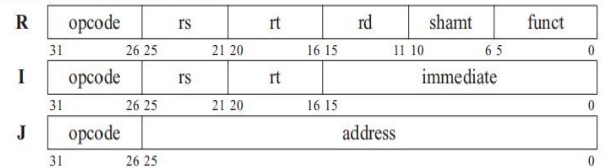

## **R-format**
|description|name|format|
|---|---|---|
rt shift left by shamt -> rd|sll |`000000_00000_xxxrt_xxxrd_shamt_000000`|
rt shift right by shamt -> rd|srl|`000000_00000_xxxrt_xxxrd_shamt_000010`
rt shift left by rs -> rd|sllv |`000000_xxxrs_xxxrt_xxxrd_00000_000100`
rt shift right by rs -> rd|srlv |`000000_xxxrs_xxxrt_xxxrd_00000_000110`
rt shift right by shamt(fill with rt[31]) -> rd|sra |`000000_00000_xxxrt_xxxrd_shamt_000011`
rt shift right by rs(fill with rt[31]) -> rd|srav |`000000_xxxrs_xxxrt_xxxrd_00000_000111`
jump to (rs)|jr |`000000_xxxrs_00000_00000_00000_001000`
rd = rt + rs|add |`000000_xxxrs_xxxrt_xxxrd_00000_100000`
rd = rt +(unsign) rs|addu |`000000_xxxrs_xxxrt_xxxrd_00000_100001`
rd = rs - rt|sub |`000000_xxxrs_xxxrt_xxxrd_00000_100010`
rd = rs -(unsign) rt|subu |`000000_xxxrs_xxxrt_xxxrd_00000_100011`
rd = rs and rt|and |`000000_xxxrs_xxxrt_xxxrd_00000_100100`
rd = rs or rt|or |`000000_xxxrs_xxxrt_xxxrd_00000_100101`
rd = rs xor rt|xor |`000000_xxxrs_xxxrt_xxxrd_00000_100110`
rd = rs nor rt|nor |`000000_xxxrs_xxxrt_xxxrd_00000_100111`
rd = 1 if rs < rt|slt |`000000_xxxrs_xxxrt_xxxrd_00000_101010`
rd = 1 if rs <(unsign) rt|sltu |`000000_xxxrs_xxxrt_xxxrd_00000_101011`

## **I-format**
|description|name|format|
|---|---|---|
rs == rt goto immediate|beq |`000100_xxxrs_xxxrt_xxxxxxximmediate`
rs != rt goto immediate|bne |`00_0101_xxxrs_xxxrt_xxxxxxximmediate`
rt <- mem((rs) + immediate)|lw |`10_0011_xxxrs_xxxrt_xxxxxxximmediate`
rt -> mem((rs) + immediate)|sw |`10_1011_xxxrs_xxxrt_xxxxxxximmediate`
rt = rs + i|addi |`00_1000_xxxrs_xxxrt_xxxxxxximmediate`
rt = rs +(unsign) i|addiu |`00_1001_xxxrs_xxxrt_xxxxxxximmediate`
rt = 1 if rs < i|slti |`00_1010_xxxrs_xxxrt_xxxxxxximmediate`
rt = 1 if rs <(unsign) i|sltiu |`00_1011_xxxrs_xxxrt_xxxxxxximmediate`
rt = rs and i|andi |`00_1100_xxxrs_xxxrt_xxxxxxximmediate`
rt = rs or i|ori |`00_1101_xxxrs_xxxrt_xxxxxxximmediate`
rt = rs xor i|xori |`00_1110_xxxrs_xxxrt_xxxxxxximmediate`
rt[31:16] = i|lui |`00_1111_00000_xxxrt_xxxxxxximmediate`

## **J-format**
|description|name|format|
|---|---|---|
pc = {pc[31:28],addr,00}|jump |`000010_(26'addr)`
pc = {pc[31:28],addr,00}, $ra = pc(next)|jal |`000011_(26'addr)`

## **additional**
|description|name|format|
|---|---|---|
|system call, code $v0($2), args $a0-a3($4-7)|syscall|`0x0000000c`|
|break with exception code|break|`26'code_001101`|

## **syscall**
|description|code|args|return|
|---|---|---|---|
|display in led|$v0 = 1|$a0 = data to display| |
|read from switch|$v0 = 5| |$v0 = data read|
|SIMD add|$v0 = 9|$a0 = src addr1 $a1 = src addr2 $a2 = dest addr||
|get cycle counter|$v0 = 10||$v0 = cycle counter|
|set cycle counter to 0|$v0 = 11|||

## **exception code (break)**
|code|description|handler|hierarchy(less is front)|
|---|---|---|---|
1|restart|start from begin|1
2|err|pause with error|2
3|continue|program continue|3
4|pause|program pause|4

