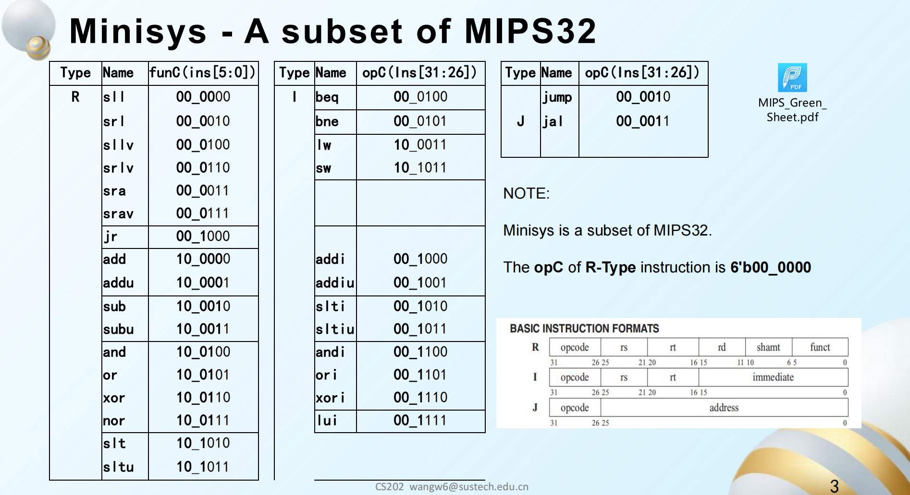
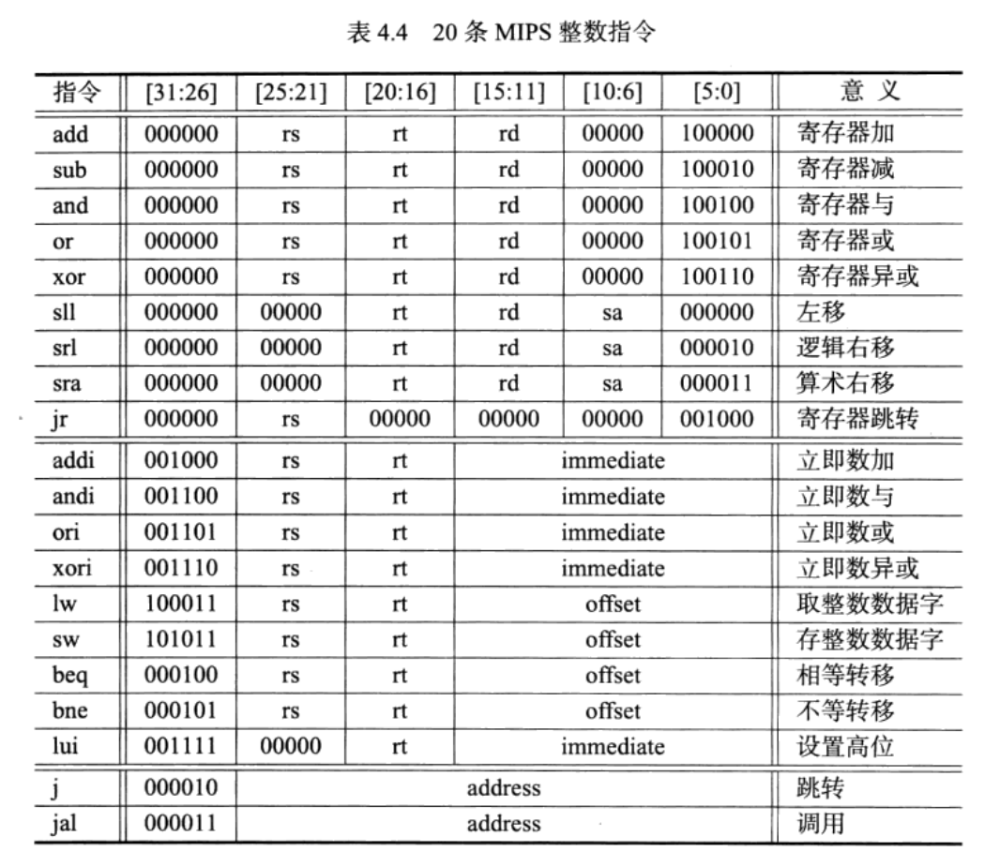

## 命名规范
modules: [名字 首字母大写 驼峰]_[描述 空格用下划线]
变量: [名字 首字母小写 驼峰]_[描述 空格用下划线]

关于描述: 

eg. "Mem_32_14" Menory 模块，32位，14位索引，则大小为 (32/8)*2^(14) = 64KB 

eg. "rs_5" 5 bit wide 'rs' 变量

## aimed bonus
pipeline SIMD 中断

## ISA

+syscall

+SIMD instruction

